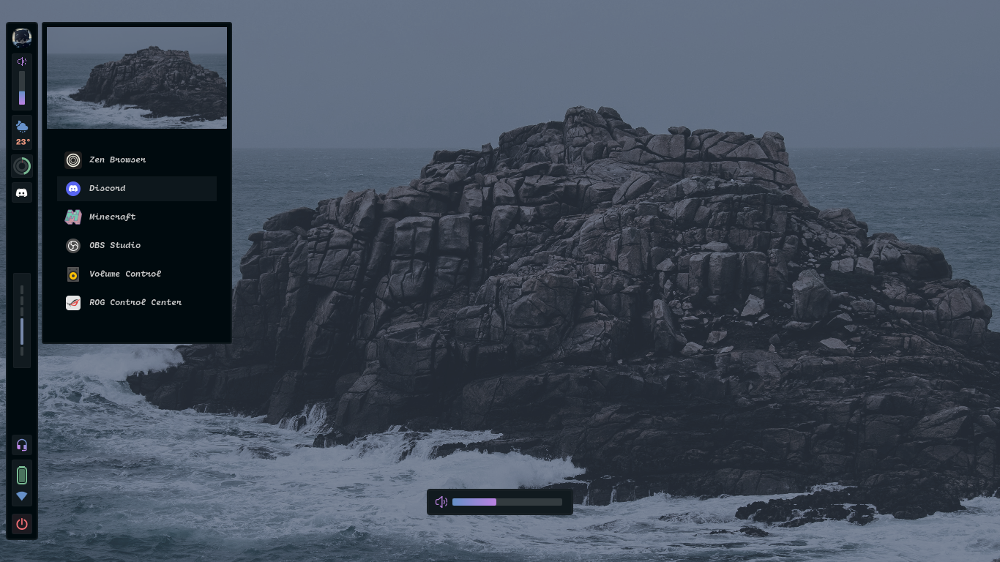

         
        
        
        
          
        
        <a href="https://discord.gg/BJtTBNYHpp" alt="Linux and Programming Community">
                  
        </a>  

     
  <table>
    <tr> <td>  </td> </tr>
  </table>
  <table>
  <tr>
    <td>
      
    </td>
    <td>
        
        
      
    </td>
  </tr>
</table>
<table>
<tr>
  <td>
    
    
  </td>
</tr>
</table>

    
 Full view (Older themes also listed and available in git history, click to expand) 

    

        
        
        
        
        
        
        
        
        
        
        
        
        
    

##

     

| Keybind | Action |
|:---------:|:--------:|
| `ALT + SHIFT + Return` | Open terminal (alacritty) |
| `CTRL + SHIFT + Q` | Kill active window |
| `ALT + [1-9]` | Switch to workspace 1-9 |
| `ALT + 0` | Switch to workspace 10 |
| `ALT + SHIFT + [1-9]` | Move window to workspace 1-9 |
| `ALT + SHIFT + 0` | Move window to workspace 10 |
| `ALT + Q` | Next workspace |
| `ALT + Tab` | Previous workspace |
| `ALT + Arrow Keys` | Move focus between windows |
| `ALT + SHIFT + Arrow Keys` | Resize window splits |
| `ALT + SPACE` | Toggle floating mode |
| `ALT + P` | Open application menu (rofi) |
| `ALT + W` | Increase volume by 10% |
| `ALT + D` | Decrease volume by 10% |
| `ALT + T` | Run password manager (getpass) |
| `ALT + M` | Create mini floating window (30% size, pinned) |
| `ALT + S` | Toggle special workspace (scratchpad) |
| `ALT + SHIFT + S` | Move window to special workspace |
| `ALT + Mouse Left` | Move window |
| `ALT + Mouse Right` | Resize window |
| `ALT + SHIFT + Q` | Exit Hyprland |

     

| Mode | Keybind | Action |
|:---------:|:--------:|:--------:|
| `Normal` | `Alt + K` | Open floating terminal |
| `Normal` | `Alt + L` | Open side terminal |
| `Normal` | `CTRL + X` | Scroll down (remapped from CTRL+E) |
| `Normal` | `CTRL + M` | Scroll up (remapped from CTRL+Y) |
| `Normal` | `gd` | Go to LSP definition (overridden in markdown for Obsidian links) |
| `Normal` | `gr` | Show LSP references |
| `Normal` | `va` | New obsidian.nvim note |
| `Normal` | `vs` | Search obsidian.nvim notes in vault |
| `Visual` | `x` | Turn selection into obsidian.nvim link |
| `Visual` | `SHIFT + Up` | Move selected text up |
| `Visual` | `SHIFT + Down` | Move selected text down |

