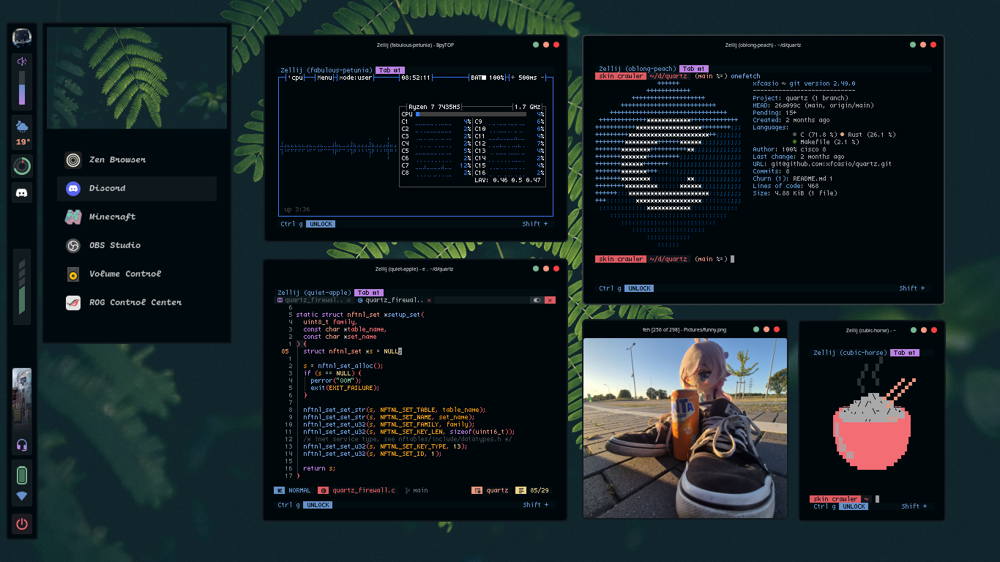
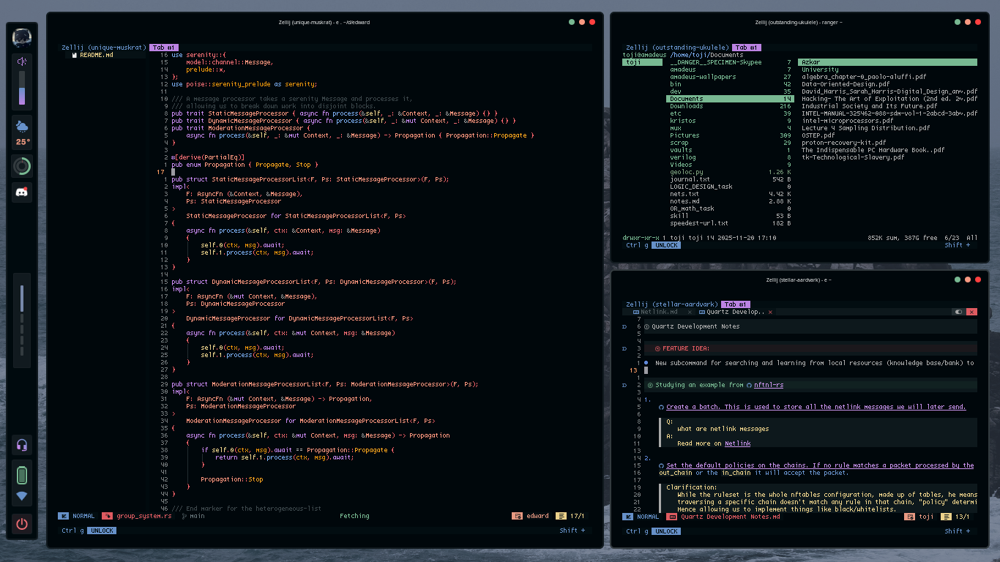
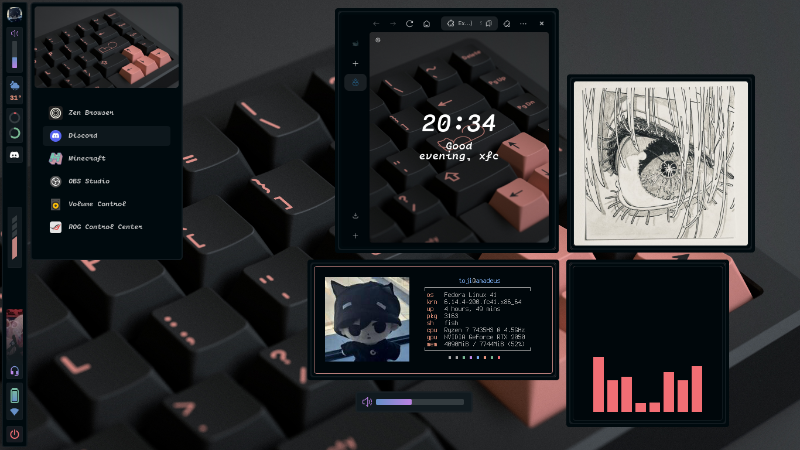
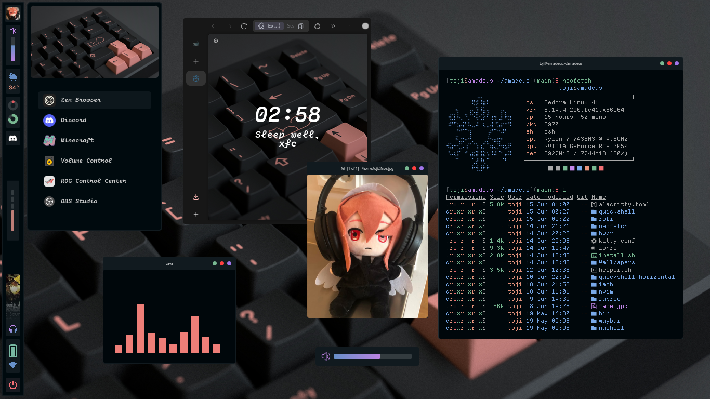
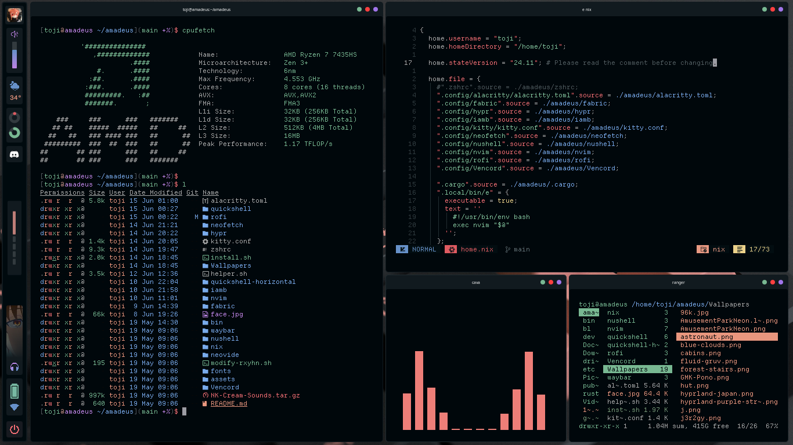
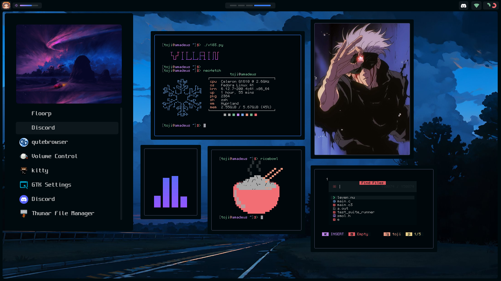

<h2 align="center"> ━━━━━━  ❖  ━━━━━━ </h2>

         
        
        
        
          
        
        <a href="https://discord.gg/BJtTBNYHpp" alt="Linux and Programming Community">
                  
        </a>  

     
  <table>
    <tr> <td>  </td> </tr>
  </table>
  <table>
    <tr>
      <td>
        
        
      </td>
    </tr>
  </table>
  <table>
  <tr>
    <td>
      
    </td>
    <td>
        
        
      
    </td>
  </tr>
</table>

    
 <samp> Full view (Older themes also listed and available in git history, click to expand) </samp> 

    

        
        
        
        
        
        
        
        
        
        
        
        
        
    

##

     

| Keybind | Action |
|:---------:|:--------:|
| <samp> `ALT + SHIFT + Return` </samp> | <samp> Open terminal (alacritty) </samp> |
| <samp> `CTRL + SHIFT + Q` </samp> | <samp> Kill active window </samp> |
| <samp> `ALT + [1-9]` </samp> | <samp> Switch to workspace 1-9 </samp> |
| <samp> `ALT + 0` </samp> | <samp> Switch to workspace 10 </samp> |
| <samp> `ALT + SHIFT + [1-9]` </samp> | <samp> Move window to workspace 1-9 </samp> |
| <samp> `ALT + SHIFT + 0` </samp> | <samp> Move window to workspace 10 </samp> |
| <samp> `ALT + Q` </samp> | <samp> Next workspace </samp> |
| <samp> `ALT + Tab` </samp> | <samp> Previous workspace </samp> |
| <samp> `ALT + Arrow Keys` </samp> | <samp> Move focus between windows </samp> |
| <samp> `ALT + SHIFT + Arrow Keys` </samp> | <samp> Resize window splits </samp> |
| <samp> `ALT + SPACE` </samp> | <samp> Toggle floating mode </samp> |
| <samp> `ALT + P` </samp> | <samp> Open application menu (rofi) </samp> |
| <samp> `ALT + W` </samp> | <samp> Increase volume by 10% </samp> |
| <samp> `ALT + D` </samp> | <samp> Decrease volume by 10% </samp> |
| <samp> `ALT + T` </samp> | <samp> Run password manager (getpass) </samp> |
| <samp> `ALT + M` </samp> | <samp> Create mini floating window (30% size, pinned) </samp> |
| <samp> `ALT + S` </samp> | <samp> Toggle special workspace (scratchpad) </samp> |
| <samp> `ALT + SHIFT + S` </samp> | <samp> Move window to special workspace </samp> |
| <samp> `ALT + Mouse Left` </samp> | <samp> Move window </samp> |
| <samp> `ALT + Mouse Right` </samp> | <samp> Resize window </samp> |
| <samp> `ALT + SHIFT + Q` </samp> | <samp> Exit Hyprland </samp> |

     

| Mode | Keybind | Action |
|:---------:|:--------:|:--------:|
| <samp> `Normal` </samp> | <samp> `Alt + K` </samp> | <samp> Open floating terminal </samp> |
| <samp> `Normal` </samp> | <samp> `Alt + L` </samp> | <samp> Open side terminal </samp> |
| <samp> `Normal` </samp> | <samp> `CTRL + X` </samp> | <samp> Scroll down (remapped from CTRL+E) </samp> |
| <samp> `Normal` </samp> | <samp> `CTRL + M` </samp> | <samp> Scroll up (remapped from CTRL+Y) </samp> |
| <samp> `Normal` </samp> | <samp> `gd` </samp> | <samp> Go to LSP definition (overridden in markdown for Obsidian links) </samp> |
| <samp> `Normal` </samp> | <samp> `gr` </samp> | <samp> Show LSP references </samp> |
| <samp> `Normal` </samp> | <samp> `va` </samp> | <samp> New obsidian.nvim note </samp> |
| <samp> `Normal` </samp> | <samp> `vs` </samp> | <samp> Search obsidian.nvim notes in vault </samp> |
| <samp> `Visual` </samp> | <samp> `x` </samp> | <samp> Turn selection into obsidian.nvim link </samp> |
| <samp> `Visual` </samp> | <samp> `SHIFT + Up` </samp> | <samp> Move selected text up </samp> |
| <samp> `Visual` </samp> | <samp> `SHIFT + Down` </samp> | <samp> Move selected text down </samp> |

<h2 align="center"> ━━━━━━  ❖  ━━━━━━ </h2>
